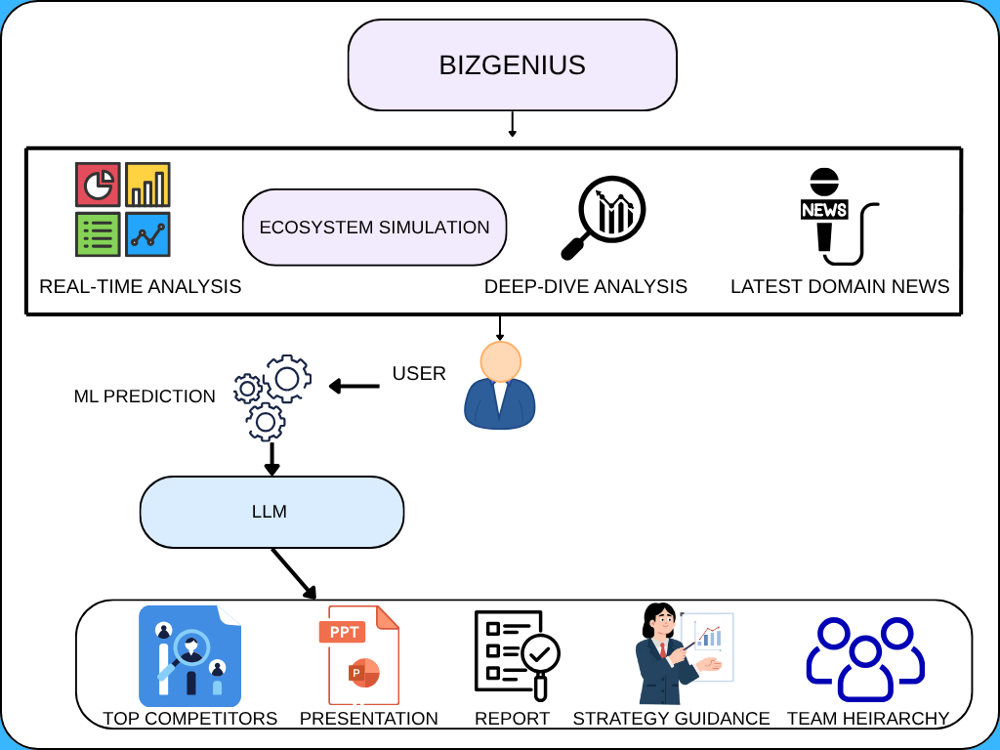
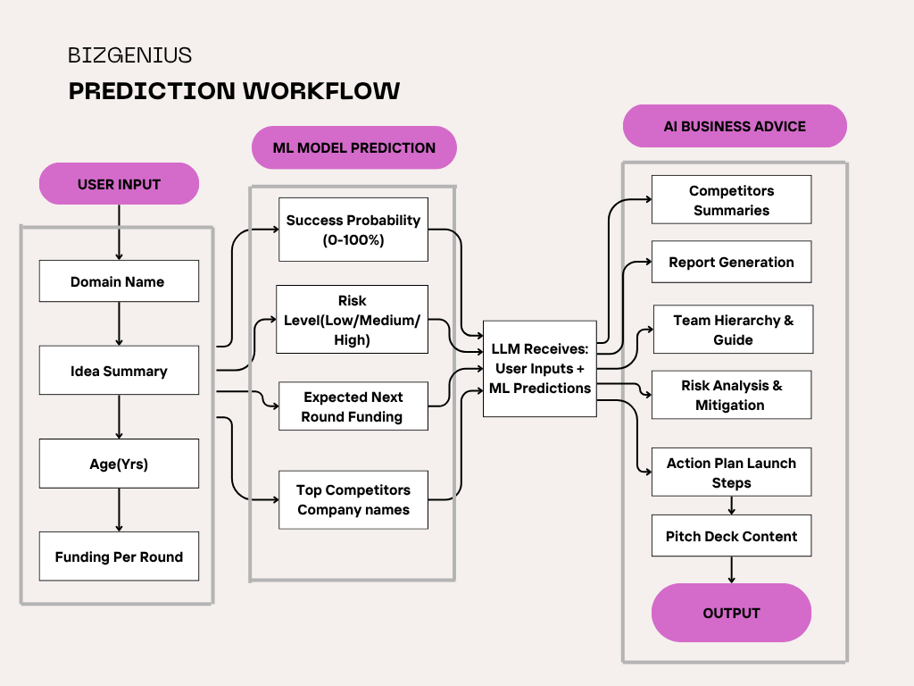

# BizGenius 🚀

## AI-Based Startup Idea Validation and Success Prediction System

BizGenius is an AI-powered platform built to help founders validate their startup ideas before they go all in. Instead of relying on expensive consultants or gut feeling, founders can enter their startup details and get instant, data-driven insights on whether their idea has what it takes.

---

## 🔗 Project Demo (Live)

👉 https://bizzgenius.netlify.app/

---

## 🎥 Project Video Demo

[▶️ Watch Demo Video](Video/BizGenius.mp4)

---

## 🛠️ Tech Stack

| Layer                              | Technologies / Tools Used                               |
| ---------------------------------- | ------------------------------------------------------- |
| **Frontend**                       | React.js, Tailwind CSS                                  |
| **Backend API**                    | FastAPI                                                 |
| **Web Scraping & Data Collection** | BeautifulSoup, Requests                                 |
| **Machine Learning Models**        | Scikit-learn, Random Forest, Gradient Boosting, XGBoost |
| **Data Processing & Analysis**     | Pandas, NumPy                                           |
| **Vector Database / RAG**          | ChromaDB                                                |
| **LLM Integration**                | LLaMA 3.3 via Groq API                                  |
| **Data Visualization**             | Matplotlib, Seaborn                                     |
| **Report Generation**              | Python PDF Libraries, PPTX Automation                   |
| **Programming Language**           | Python 3.9+                                             |

---

## ⚙️ What it does

BizGenius is an AI-powered startup validation platform that tells founders within minutes whether their business idea has real potential.

A user simply enters their startup details:

- 🏢 Business domain & idea description  
- 📅 Company age & funding history  
- 👥 Team size & number of investors  
- 💰 Funding per round  

BizGenius then delivers a complete startup intelligence report across key outputs:

### 1. Success Prediction
Using a Random Forest Classifier trained on 3,000 startup records, the system predicts:
- Success  
- Uncertain  
- Failure  

With confidence probability scores.

---

### 2. Funding Estimation
A Gradient Boosting Regressor predicts next funding round with **2.27% MAPE**.

---

### 3. Ecosystem Analysis
- Startup distribution graphs  
- City-wise success rates  
- Funding trends  

---

### 4. Competitor Analysis
RAG system (ChromaDB) finds similar startups and benchmarks the idea.

---

### 5. AI Strategic Insights
LLaMA 3.3 generates:
- Risk factors & mitigation  
- Differentiation strategy  
- 30-day action plan  
- Investor summary  

---

### 6. Automated Report & Pitch Deck
- 📄 PDF report  
- 📊 PPTX pitch deck  

---

## 📊 Data Foundation

- Crunchbase → funding & investors  
- Wikipedia → company info  
- Public directories → geo & sector data  

Dataset expanded from ~300 → **3000 records** using:
- Log-normal  
- Poisson  
- Exponential distributions  

---

## 🧠 System Design

  

---

## 🔄 Flowchart

  

---

## 🚀 Usage

1. Open the app  
2. Explore dashboard  
3. Enter startup details  
4. Click **Predict & Analyse**  
5. Review insights  
6. Download reports  

---

## 🌟 Why BizGenius?

✔ ML + LLM + RAG combined  
✔ Real + synthetic dataset  
✔ End-to-end startup intelligence  
✔ Instant actionable insights  

---
